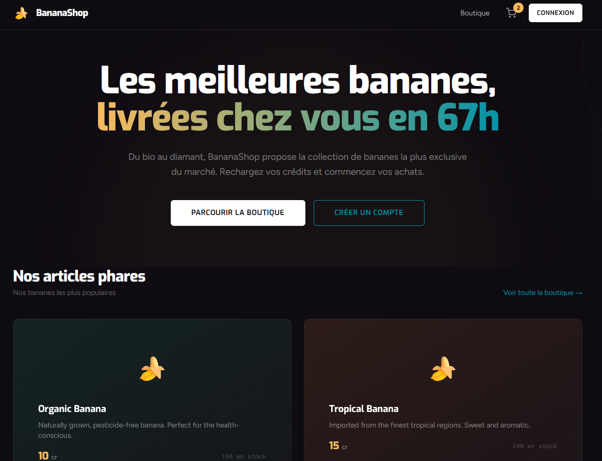
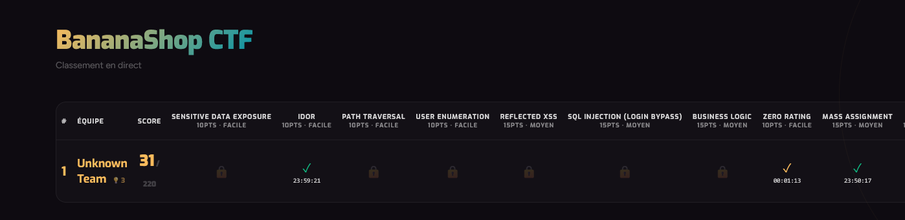

# MidHack - BananaShop CTF

Plateforme CTF (Capture The Flag) pour un atelier d'initiation à la sécurité offensive. BananaShop est une application e-commerce **intentionnellement vulnérable** où les participants doivent découvrir et exploiter des failles de sécurité pour capturer des flags.

## Concept

L'atelier se décompose en **trois parties** :

1. **Le site BananaShop** - une application e-commerce React + Express contenant 14 vulnérabilités à exploiter
2. **Le serveur d'exploit** - un espace par équipe avec webhook, générateur CSRF, outils d'exploitation et soumission de flags
3. **Le dashboard live** - un tableau de scores en temps réel (WebSocket) à projeter, affichant la progression de chaque équipe

Une **mini-académie** intégrée au serveur d'exploit propose des slides interactives couvrant les phases du pentest et chaque type de vulnérabilité (explication, détection, exemples de code, remédiation).

## Aperçu

### Application vulnérable



### Tableau de classement temps réel



## Quick Start

### Docker (recommandé - setup multi-équipes)

```bash
./setup.sh 6            # génère docker-compose.yml pour 6 équipes (1 à 20)
docker compose up --build -d
```

Le script `setup.sh` génère le `docker-compose.yml` avec le nombre d'équipes souhaité (défaut : 4). Chaque équipe obtient un site BananaShop et un exploit server sur des ports dédiés :

| Service        | Ports              |
| -------------- | ------------------ |
| Dashboard live | `localhost:5000`   |
| Site Team N    | `localhost:300N`   |
| Exploit Team N | `localhost:400N`   |

### Développement local

```bash
npm run install:all
npm run dev
```

Lance les 4 services simultanément (server, client, exploit-server, dashboard) via `concurrently`.

### Déploiement sur un serveur

Prérequis sur la machine cible : `git`, `docker` et `docker compose` (plugin officiel).

```bash
git clone <url-du-repo> midhack
cd midhack
./setup.sh 4          # génère docker-compose.yml pour 4 équipes
docker compose up --build -d
```

Le `-d` lance les containers en arrière-plan. Vérifier ensuite leur état avec `docker compose ps` et suivre les logs avec `docker compose logs -f`.

Ports à ouvrir dans le firewall du serveur (ou dans le groupe de sécurité cloud) :

| Port      | Rôle                          |
| --------- | ----------------------------- |
| 5000      | Dashboard live                |
| 3001-3004 | Sites BananaShop (Team 1 à 4) |
| 4001-4004 | Exploit servers (Team 1 à 4)  |

Les participants accèdent ensuite aux URLs via l'IP/le domaine public du serveur (ex. `http://ctf.asymis.fr:3001`).

**Mettre à jour** après un `git pull` :

```bash
docker compose up --build -d
```

**Arrêter / nettoyer** :

```bash
docker compose down          # arrête les containers
docker compose down -v       # arrête + supprime les volumes (reset complet)
```

### Mode Nantes@Hack

Pour un événement co-organisé avec [Nantes@Hack](https://nantes-hack.fr), un logo peut être affiché dans les 3 UIs (site BananaShop, exploit server, dashboard). Activation :

1. Déposer le logo aux chemins `client/public/nantes-hack.png`, `exploit-server/client/public/nantes-hack.png`, `dashboard/client/public/nantes-hack.png`
2. En haut de [docker-compose.yml](docker-compose.yml), passer `VITE_NANTES_HACK: "0"` → `"1"`
3. Rebuild : `docker compose up --build -d`

Pour désactiver : remettre `"0"` et rebuild.

## Architecture

```text
midhack/
├── client/          # Frontend React + Vite + Tailwind CSS
├── server/          # API Express.js + SQLite (vulnérabilités)
├── exploit-server/  # Serveur d'équipe : webhook, académie, outils
├── dashboard/       # Scoreboard live WebSocket (à projeter)
└── docker-compose.yml
```

- **server/** - API Express.js + SQLite, contient les 14 vulnérabilités
- **client/** - SPA React avec Vite et Tailwind CSS
- **exploit-server/** - Webhook receiver, mini-académie, générateur CSRF, soumission de flags
- **dashboard/** - Tableau de scores temps réel via WebSocket, persistance JSON

## Vulnérabilités

| # | Type | Catégorie OWASP | Difficulté | Actif |
| --- | ------ | --------------- | ---------- | ----- |
| 1 | Sensitive Data Exposure | Security Misconfiguration | Facile | ✅ |
| 2 | IDOR | Broken Access Control | Facile | ✅ |
| 3 | Path Traversal | Broken Access Control | Facile | ✅ |
| 4 | Zero Rating Bypass | Insecure Design | Facile | ✅ |
| 5 | Reflected XSS | Injection | Facile | ✅ |
| 6 | Mass Assignment | Insecure Design | Moyen | ✅ |
| 7 | JWT Forging (secret faible) | Cryptographic Failures | Moyen | ✅ |
| 8 | SQL Injection (Login Bypass) | Injection | Moyen | ✅ |
| 9 | Business Logic (crédits négatifs) | Insecure Design | Moyen | ✅ |
| 10 | CSRF | Broken Access Control | Moyen | ❌ |
| 11 | SQL Injection (UNION) | Injection | Difficile | ✅ |
| 12 | Stored XSS | Injection | Difficile | ✅ |
| 13 | SSRF | Server-Side Request Forgery | Difficile | ❌ |
| 14 | Cookie Theft via XSS | Injection + Auth Failures | Difficile | ✅ |

## Scoring

- Chaque flag rapporte des points selon sa difficulté (Facile=10 / Moyen=15 / Difficile=25)
- Utiliser un indice coûte des points (configurable via `HINT_PENALTY`, défaut : 5)
- En cas d'égalité : nombre de flags > temps de première capture

## Déroulement suggéré (2h)

| Durée | Activité |
|-------|----------|
| 0:00 - 0:15 | Intro OWASP Top 10 + outils (DevTools, Burp Suite) |
| 0:15 - 1:45 | CTF libre - les équipes exploitent les vulnérabilités |
| 1:45 - 2:00 | Debrief - walkthrough de chaque vuln + remédiations |

## Outils utiles pour les participants

- **Burp Suite Community** pour intercepter et forger des requêtes HTTP
- L'extension **JWT** de Burp Suite pour décoder et modifier des tokens JWT
- L'onglet **Académie** du serveur d'exploit pour apprendre les techniques
