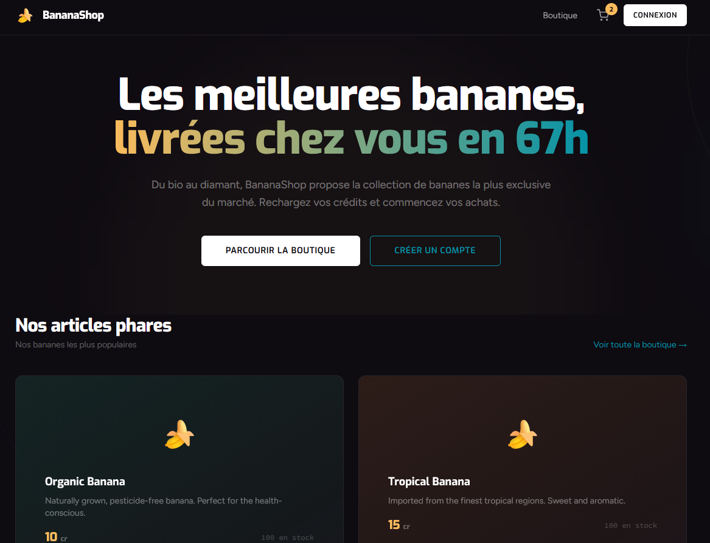
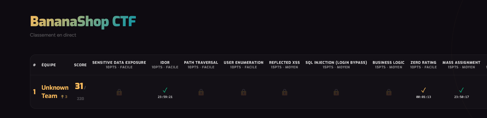

# MidHack - BananaShop CTF

BananaCTF est une plateforme CTF  pour un atelier d'initiation à la sécurité offensive / pentest. Elle contient principalement une application e-commerce **volontairement vulnérable** où les participants doivent découvrir et exploiter des failles de sécurité pour capturer des flags.

## Concept

L'atelier se décompose en **trois parties** :

1. **Le site BananaShop** - une application e-commerce React + Express contenant une dizaine vulnérabilités à exploiter pour tous niveaux débutants / intermédiaires
2. **Le serveur d'exploit** - un espace par équipe avec webhook, outils d'exploitation et soumission de flags
3. **Le dashboard live** - un tableau de scores en temps réel (WebSocket) à projeter, affichant la progression de chaque équipe

Une **mini-académie** intégrée au serveur d'exploit propose des slides interactives couvrant les phases du pentest et chaque type de vulnérabilité (explication, détection, exemples de code, remédiation).

Un **parcours d'onboarding guidé** s'affiche automatiquement à la première connexion sur le Hacking QG et sur le site BananaShop, pour s'assurer que les participants lisent les instructions et configurent Burp Suite avant de commencer.

## Public 

Due à la facilité des vulnérabilités, Cette plateforme se classerait dans un niveau facile, voire moyen, dans les CTF traditionnels. Cette plateforme est utilisée en particulier pour des développeurs ou des étudiants en cyber.

## Guide animateur

Bien que l'application puisse être utilisée par une personne seule, il est fortement conseillé d'utiliser la plateforme avec un public en équipe et un animateur expérimenté. 

Voir [docs/ANIMATEUR.md](docs/ANIMATEUR.md) pour les instructions de setup, le déroulement de l'atelier, les comptes et secrets, et la gestion du panel admin.

## Aperçu

### Application vulnérable



### Tableau de classement temps réel



## Quick Start

### Docker (recommandé - setup multi-équipes)

Prérequis sur la machine cible : `git`, `docker` et `docker compose` (plugin officiel).

```bash
git clone <url-du-repo> midhack
cd midhack
cp .env.example .env   # créer la config, puis l'éditer (nombre d'équipes, ports, titre…)
./setup.sh deploy      # génère docker-compose.yml + credentials, build & démarre
```

**Toute la configuration de l'événement se fait dans le fichier `.env`** : nombre d'équipes (`TEAMS`), noms (`TEAM_NAMES`), port de départ (`START_PORT`), titre (`EVENT_TITLE`), pénalité d'indice (`HINT_PENALTY`), branding (`VITE_NANTES_HACK`)… Le script `setup.sh` ne fait que des **actions** : `deploy`, `passwords`, `reset` (voir `./setup.sh --help`). Il lit le `.env` et génère le `docker-compose.yml` en conséquence.

Vérifier l'état des conteneurs avec `docker compose ps` et suivre les logs avec `docker compose logs -f`.

Les ports exposés sont attribués de façon contiguë à partir de `START_PORT` (défaut `44001`, configurable dans `.env`) :

| Service        | Port exposé             |
| -------------- | ----------------------- |
| Dashboard live | `START_PORT` (ex 44001) |
| Site Team N    | `START_PORT + 2N − 1`   |
| Exploit Team N | `START_PORT + 2N`       |

Pensez à ouvrir ces ports dans le firewall du serveur (ou le groupe de sécurité cloud). Les URLs et mots de passe effectifs de chaque équipe sont écrits dans `credentials.json` / `credentials.html` à la génération.

**Mettre à jour** après un `git pull` :

```bash
./setup.sh deploy            # régénère le docker-compose.yml et relance
```

**Arrêter / nettoyer** :

```bash
docker compose down          # arrête les containers
./setup.sh reset             # arrête + supprime volumes et fichiers générés (reset complet)
```

### Développement local

```bash
npm run install:all
npm run dev
```

Lance les 4 services simultanément (server, client, exploit-server, dashboard) via `concurrently`.

## Architecture

```text
midhack/
├── client/          # Frontend React + Vite + Tailwind CSS
├── server/          # API Express.js + SQLite (vulnérabilités)
├── exploit-server/  # Serveur d'équipe : webhook, académie, outils
├── dashboard/       # Scoreboard live WebSocket (à projeter)
└── docker-compose.yml
```

- **server/** - API Express.js + SQLite, contient les 14 vulnérabilités
- **client/** - SPA React avec Vite et Tailwind CSS
- **exploit-server/** - Webhook receiver, mini-académie, générateur CSRF, soumission de flags
- **dashboard/** - Tableau de scores temps réel via WebSocket, persistance JSON

## Vulnérabilités

| # | Type | Catégorie OWASP | Difficulté | Actif |
| --- | ------ | --------------- | ---------- | ----- |
| 1 | Sensitive Data Exposure | Security Misconfiguration | Facile | ✅ |
| 2 | IDOR | Broken Access Control | Facile | ✅ |
| 3 | Path Traversal | Broken Access Control | Facile | ✅ |
| 4 | Zero Rating Bypass | Insecure Design | Facile | ✅ |
| 5 | Reflected XSS | Injection | Facile | ✅ |
| 6 | Mass Assignment | Insecure Design | Moyen | ✅ |
| 7 | JWT Forging (secret faible) | Cryptographic Failures | Moyen | ✅ |
| 8 | SQL Injection (Login Bypass) | Injection | Moyen | ✅ |
| 9 | Business Logic (crédits négatifs) | Insecure Design | Moyen | ✅ |
| 10 | CSRF | Broken Access Control | Moyen | ❌ |
| 11 | SQL Injection (UNION) | Injection | Difficile | ✅ |
| 12 | Stored XSS | Injection | Difficile | ✅ |
| 13 | SSRF | Server-Side Request Forgery | Difficile | ❌ |
| 14 | Cookie Theft via XSS | Injection + Auth Failures | Difficile | ✅ |

## Scoring

- Chaque flag rapporte des points selon sa difficulté (Facile=10 / Moyen=15 / Difficile=25)
- Utiliser un indice coûte des points (configurable via `HINT_PENALTY` dans le `.env`, défaut : 3)
- En cas d'égalité : nombre de flags > temps de première capture

## Onboarding des participants

À la première connexion, une **modale bloquante** s'affiche sur le Hacking QG et sur le site BananaShop. Elle guide les participants en 5 étapes avant de leur donner accès aux outils :

1. **Présentation** — introduction à l'onboarding et à l'outil Burp Suite
2. **Guide Burp** — lien vers le guide d'installation (`/installation-burp.html`)
3. **Exercice Burp** — envoyer une requête et la retrouver dans l'historique HTTP pour la rejouer dans le Repeater avec la bonne valeur, ce qui révèle le flag de démarrage
4. **Déroulement du CTF** — process de recherche de vulnérabilités suggéré
5. **Flag** — saisie du flag de démarrage pour déverrouiller l'interface

Le flag de démarrage est renvoyé par la route `POST /hello-my-flag` lorsque le participant envoie la bonne valeur dans le corps de la requête (exercice guidé à l'étape 03). Une fois le flag soumis, tous les menus du QG et du BananaShop se déverrouillent. L'état est persisté en `localStorage`.

## Déroulement suggéré (2h)

| Durée | Activité |
|-------|----------|
| 0:00 - 0:15 | Intro OWASP Top 10 + outils (DevTools, Burp Suite) |
| 0:15 - 1:45 | CTF libre - les équipes exploitent les vulnérabilités |
| 1:45 - 2:00 | Debrief - walkthrough de chaque vuln + remédiations |

## Outils pour les participants

- **Burp Suite Community** pour intercepter et forger des requêtes HTTP
- L'extension **JWT** de Burp Suite pour décoder et modifier des tokens JWT
- L'onglet **Académie** du serveur d'exploit pour apprendre les techniques

## Licence

Ce projet — code source, documentation et supports pédagogiques — est distribué sous licence **[Creative Commons Attribution - Pas d'Utilisation Commerciale - Partage dans les Mêmes Conditions 4.0 International (CC BY-NC-SA 4.0)](https://creativecommons.org/licenses/by-nc-sa/4.0/deed.fr)**.

Vous êtes libre de **partager**, **réutiliser** et **modifier** ce travail, à condition de :

- **Attribution (BY)** — créditer l'auteur d'origine et indiquer la provenance ;
- **Pas d'Utilisation Commerciale (NC)** — ne pas en faire un usage commercial ;
- **Partage dans les Mêmes Conditions (SA)** — distribuer toute version dérivée sous cette même licence.

Texte légal complet : voir le fichier [LICENSE](LICENSE).

---

Développé par Johan Brun

Utilisé dans le cadre des initations à la sécurité offensive de l'association [Nantes@Hack](https://www.meetup.com/nantesathack/).
